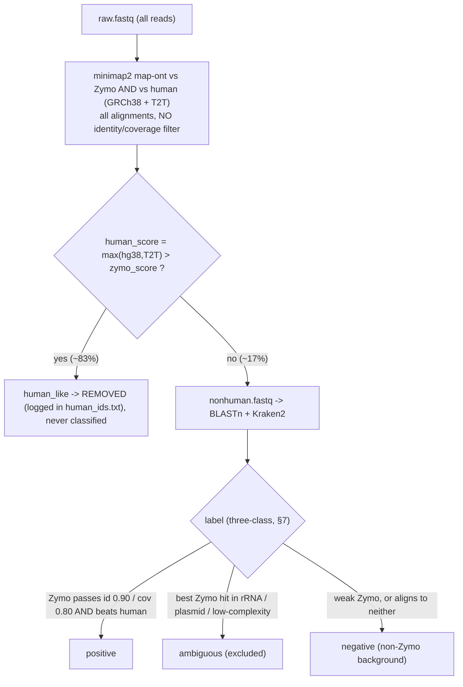

# Reporting 1 — Methodology (reproducible)

**Project:** Machine-learning discrimination of true ZymoBIOMICS reads from false
positives in a ~99 % human, Oxford Nanopore adaptive-sampling matrix, and
pre-registered testing of hypotheses H1–H12.
**Status:** wired, validated pipeline; all hard prerequisites are now in place
(Kraken2 DB provided + wired, Zymo reference built). The inference and
ground-truth layers were remediated after the critical review (see
`reporting_3_critical_review.md`; model-selection/power reasoning in
`reporting_4_model_selection_and_power.md`). Document date: 2026-08-03 (revised
2026-08-04: F1–F7 + F9 + F6 remediation and Kraken2 DB).

This report is the human-readable companion to the code in `scripts/` and the
live open-items tracker `open_items_v3.md`. Every design decision, correction and
caveat implemented across development is captured here so the method is
reproducible from the raw reads.

---

## 1. Study design

- **Community:** ZymoBIOMICS Gut Microbiome Standard (D6331) spiked into human
  clinical background at five 10× titration levels (c1 highest → c5 lowest) plus a
  no-spike **negative** barcode per donor.
- **Input cells per library (nominal):** c1 = 7.88×10⁷, c2 = 7.88×10⁶,
  c3 = 7.88×10⁵, c4 = 7.88×10⁴, c5 = 7.88×10³, negative = 0. Carried per library in
  the sample sheet `concentration` column.
- **Donors (LOEO fold unit):** 8 donors — **D01, D03, D04, D05, D06, D07, D08, D09**
  (D02 absent, D09 present). The donor set is derived at run time from the sample
  sheet, not hard-coded.
- **Libraries:** 48 = 8 donors × 6 barcodes (negative + c1–c5).
- **Sequencing:** ONT with live adaptive-sampling human depletion against GRCh38.
  **Basecaller (fixed, recorded):** Dorado 2.0.0, model
  `dna_r10.4.1_e8.2_400bps_hac@v6.0.0`, kit SQK-NBD114-96 (**hac**, not sup →
  single-read identity mode ≈ 0.95–0.98).
- **Run structure:** one flow cell per donor (`run_id` = flow-cell UUID) ⇒ **run is
  confounded with donor**; LOEO removes it but a separate run effect is not
  estimable (documented limitation).

## 2. Software environment (reproducibility)

Host: Ubuntu 24.04 (noble), x86_64. Fixed seed **1729** throughout.

| Component | Version / value |
|---|---|
| R | 4.5.3 (`/usr/local/bin/R`) |
| R library | `R_LIBS_USER=/home/tdinse/R/x86_64-pc-linux-gnu-library/4.5` (set in `~/.Renviron`) |
| data.table | 1.18.4 |
| ranger | 0.18.0 |
| xgboost | 3.2.1.1 |
| glmmTMB | 1.1.14 |
| lmerTest | 3.2.1 |
| arrow | 25.0.0 |
| Biostrings | 2.78.0 (installed 2026-08-03; DUST / homopolymer / GC complexity features) |
| minimap2 | 2.26-r1175 |
| blastn / blastdbcmd | 2.12.0+ |
| kraken2 / kraken2-build | 2.1.3 |
| samtools | 1.19.2 |
| seqkit | 2.3.0 |
| barrnap | 1.10.5 (conda env `zymo_prep`, invoked via `conda run`) |

**Environment fixes applied (reproducibility caveats):**
- The inherited `R_LIBS_USER` pointed at a non-existent `/home/diablo/.../4.4/`
  path; repointed to a writable 4.5 user library via `~/.Renviron`.
- No `cmake`/`sudo` on the host → R packages are installed as **precompiled
  binaries** to avoid source compilation:
  `repos = "https://packagemanager.posit.co/cran/__linux__/noble/latest"` with the
  matching `HTTPUserAgent`.
- barrnap is a Perl tool needing its env's modules → always run via
  `conda run -n zymo_prep barrnap`, never the raw binary.

## 3. Pipeline overview

Single source of truth: `scripts/00_config.R` (all paths, parameters, feature
blocks, hypothesis registry). Orchestrated by `scripts/run_pipeline.R`
(`--status`, `--from NN`, `--only …`). Stages:

| Stage | Script | Output |
|---|---|---|
| — | `00_config.R`, `utils.R` | config + shared metric/stat helpers |
| prep | `prepare_zymo_genomes.R` | `ref/zymo_members.fasta`, `ref/zymo_contig2species.tsv` |
| prep | `prepare_ambiguous_regions.R` | `ref/zymo_ambiguous_regions.bed` |
| prep | `prepare_kraken2_from_core_nt.sh` | *optional* controlled-comparison Kraken2 db |
| prep | `prepare_cutoff_sensitivity.R` | ground-truth cutoff sweep (F9) — run after stage 01 |
| 01 | `01_external_tools.R` | QC, minimap2 PAFs, human-depleted reads, BLASTn, Kraken2 |
| 02 | `02_ground_truth_labels.R` | `labels.tsv`, `expected_sample_taxon.tsv`, `sample_taxon_coverage.tsv`, `leakage_estimates.tsv` |
| 03 | `03_build_features.R` | taxon-agnostic `feature_table` |
| 04 | `04_cv_splits.R` | nested LOEO + LOTO splits (donor-grouped; LOTO donor-splits negatives, F1) |
| 05 | `05_train_models.R` | `predictions.tsv.gz`, `inner_cv_scores.tsv` (F2) |
| 06 | `06_evaluate.R` | read + sample×taxon metrics (incl. breadth ablation, F6), `calibration.tsv`, `model_comparison.tsv` |
| 07 | `07_hypothesis_tests.R` | `hypothesis_tests.tsv` (H1–H12 + H5b + H9b), `mixed_model_supplement.tsv` (F3), `h9_species_sensitivity.tsv` (H9) |

## 4. Inputs and hardcoded paths

Sample sheet (`data/sample_sheet.tsv`), one row per library:
`library_id, donor, barcode, titration_level, concentration, run_id, fastq,
seq_summary`. `fastq` is an absolute path (one chunk per barcode); `seq_summary`
is the ONT **reports folder**, from which stage 01 selects the
`sequencing_summary_*<run_id>*.txt` by run-id prefix.

References / databases (config §1):
- Zymo genomes: `/home/tdinse/Downloads/D6331.refseq/genomes` (21 files) →
  built into `ref/zymo_members.fasta`.
- Human: GRCh38 `/home/tdinse/new_hg38/hg38.fa` **and** T2T-CHM13
  `/home/tdinse/new_T2T/T2T.fasta` — both feed the `human_score = max(hg38, T2T)`
  depletion + ground-truth competition; T2T additionally feeds the human-competitor
  feature.
- BLAST: core_nt `/home/tdinse/core_nt/core_nt` (277 GB, multi-volume, `taxdb`
  present for `staxid`).
- Kraken2: `database_kraken2/k2_NCBI_reference_20251007` (curated species-level NCBI
  reference DB, provided 2026-08-04 as a `.tar.gz` + extracted in place — see §11).
- CoA: `data/zymo_coa_lot_LOT_ID.tsv` (per-species relative abundance).

## 5. Reference preparation

- **Genome collapse:** each D6331 genome is collapsed to a single species-named
  record (multi-contig assemblies joined by 100 bp N-spacers to block spurious
  cross-contig alignments); all are concatenated into `zymo_members.fasta`.
  `contig2species` is regenerated to match. Species names are canonicalised to the
  CoA convention (e.g. `Candida_albican`→`Candida_albicans`,
  `…_b2207`→`…_B2207`).
- **E. coli collapse [caveat]:** the D6331 lot contains **5 near-identical E. coli
  strains** (0.028 each = 0.14 combined). ONT reads cannot resolve them and the
  species-level Kraken2 DB does not either, so at the **sample×taxon / Poisson**
  level the 5 strain contigs are grouped to one `Escherichia_coli` taxon (CoA
  abundance summed to 0.14 → 17 species total). All 5 strain genomes are **kept in
  the minimap2 reference** so read-level positive calling stays at full identity.
- **Ambiguous / excluded regions:** rRNA loci are conserved and would make ground
  truth circular, so reads whose best Zymo hit falls in these regions are excluded
  (not forced into the binary). The BED is the union of (i) the supplier 16S/18S
  gene body aligned back to each genome, and (ii) **full rRNA operons from barrnap**
  (`--kingdom` bac/arc/euk by member). *Deferred:* plasmid backbones (lost to the
  genome collapse) and mobile elements (least critical).

## 6. QC and offline human depletion

Per library: QC stats (length, mean-Q, GC via seqkit) and ONT `end_reason` (to
flag unblocked/truncated adaptive-sampling reads). minimap2 aligns all reads to
(i) Zymo members, (ii) GRCh38, (iii) T2T-CHM13.

**Human depletion (before classification) — competition, not gating.** A read is
removed as *human_like* iff it aligns **better to human than to any Zymo member**:
`human_score = max(GRCh38, T2T)` residue matches `>` best Zymo score. There is
**no identity/coverage gate** — minimap2's long-read `map-ont` preset under-aligns
the short reads in this data, so a coverage gate silently let ~83 % of human reads
leak into the classifier (they aligned to human but fell below the gate, inflating
the BLAST workload ~6×). The competition removes that ~83 % while **preserving
every read a Zymo member wins** (only ~0.1 % of reads align to both). Crucially it
is the **same** human-vs-Zymo rule the ground-truth labeller uses (§7), so
depletion and the positive/negative labels are consistent by construction.
Surviving reads form `nonhuman.fastq`, the **single shared read universe scored by
both classifiers** (so H1 is not confounded by different read sets); removed IDs
are logged to `human_ids.txt`.



Adaptive sampling already depleted human live, so this offline pass is a second
pass; a small human residue among the survivors is still possible by design.

## 7. Ground truth (three-class, non-circular)

For each **non-human** read, from the minimap2 PAFs:
- **positive** — aligns to a Zymo member at identity ≥ 0.90 and coverage ≥ 0.80
  **and** scores better on Zymo than on human (`human_score = max(GRCh38, T2T)`,
  margin 0) — the identical competition used for depletion (§6);
- **ambiguous (excluded)** — best Zymo hit lies in an rRNA/ambiguous BED region;
- **negative** — everything else (non-Zymo bacteria, any residual human, unaligned).

Ground truth is derived from minimap2 only, i.e. **independent of both BLASTn and
Kraken2**, so the classifiers are compared against a fixed target.

**Cutoff sensitivity [F9].** The identity ≥ 0.90 / coverage ≥ 0.80 cutoffs are
stress-tested, not assumed. `scripts/prepare_cutoff_sensitivity.R` (run after
stage 01) builds the empirical identity/coverage distribution of **confident**
Zymo reads — those whose Zymo minimap2 hit beats human, a criterion *independent
of* the cutoffs under test — and sweeps a grid of (identity × coverage) cutoffs,
recording the fraction of that confident set retained
(`work/cutoff_sensitivity.tsv`, `work/cutoff_zymo_distribution.tsv`). It then
recommends the strictest cutoffs that still retain ≥ `gt_retain_frac` (0.95), so
the positive label set — the input to *every* endpoint — can be shown stable
across a defensible range (grid + target in `cfg$params$gt_identity_grid` /
`gt_coverage_grid` / `gt_retain_frac`).

## 8. Detectability floor and sample×taxon truth

For each (library × taxon): `E[genomes] = concentration × rel_abundance ×
extraction_eff × fraction_loaded`; `P(≥1) = 1 − exp(−E)`.
- `extraction_eff = 0.5`, `fraction_loaded = 1.0` (**combined recovery ≈ 0.5** — see
  caveat §12), `poisson_p_min = 0.95`.
- (library × taxon) with `P(≥1) ≥ 0.95` are **expected_present** (true positives for
  recall); those spiked but below the floor are **indeterminate** and excluded from
  recall accounting; taxa with 0 input cells (negative barcodes) are **not expected**,
  so any Zymo read there is treated as leakage/contamination (false positive).
- The a-priori grid is written to `work/expected_sample_taxon.tsv` and used as the
  sample×taxon truth in stage 06.

## 9. Cross-barcode leakage / contamination diagnostic

Because every donor's 6 barcodes share one flow cell, the low-mass c4/c5 (and
negative) barcodes can be inflated by index-hopping/demux crosstalk from the
high-mass barcodes. `estimate_leakage()` reports, **per run**, the
negative (c0) barcode's read makeup and its apparent Zymo-positive rate — a
principled **upper bound** on cross-barcode leakage — to
`work/leakage_estimates.tsv` (`negative_reads`, `negative_background`,
`negative_zymo_positive`, `leakage_upper_bound`). This is a **diagnostic for a
downstream sensitivity analysis**, not a per-read correction: the earlier
`suspected_leakage` flag (which flagged individual reads **at random**) was inert
and unprincipled, so it was removed [F7]. The negative barcode is the donor's
no-spike background run through the same human depletion, so its survivors are
endogenous microbiome + reagent kitome + residual human — not pure human — and any
Zymo-positive read there is genuine leakage/contamination.

## 10. Classification arms (independent)

BLASTn and Kraken2 classify the **same** non-human reads **independently** (neither
gates the other):
- **BLASTn** vs core_nt, `outfmt 6` with `staxid`, top-N hits.
- **Kraken2** at `--confidence 0` (confidence kept as a downstream feature).

## 11. Database comparability (key methodological decision)

For a fair H1 (algorithm, not database), each classifier uses its idiomatic,
appropriate reference, and the minimap2 ground truth keeps the comparison fair:
- **BLASTn → core_nt** (comprehensive; also the subject of the H7 contamination
  analysis).
- **Kraken2 → curated species-level DB** — provided as `k2_NCBI_reference_20251007`
  (NCBI reference, one reference per species, incl. fungi/protists),
  **not** Kraken2 Standard (lacks fungi/protists → misses Zymo Candida/Saccharomyces)
  and **not** a core_nt-derived Kraken2 (nt redundancy degrades LCA resolution and
  the per-species k-mer-count features). An optional controlled arm building Kraken2
  *from core_nt* (`prepare_kraken2_from_core_nt.sh`) is provided for an
  algorithm-only comparison.

## 12. Feature engineering

Taxon **identity is never a model feature** (only the taxon-agnostic subject
property `subject_genome_len`). Feature blocks: BLAST core (qlen, pident, evalue,
mismatch, alignment fraction, query coverage, bitscore); BLAST margin (bitscore
margin to a different species, distinct species/genera in top-N, taxonomic
entropy); human-competitor (T2T bitscore/identity, margin vs best); Kraken2
internals (confidence, k-mers-to-taxon fraction, distinct minimizers); sequence
complexity (DUST, GC, homopolymer); read QC (length, mean-Q, end_reason unblock);
sample×taxon aggregates (see §13). **Residual adapter/barcode content is
deliberately excluded** from the model features and computed only for the H7
exploratory test. (Always-NA LCA-rank and unproduced assembly-level/WGS-draft
columns were dropped — see reporting_3 M1/M3.)

## 13. Read-count normalisation

Read yield varies widely across donors/barcodes (10× dilution + adaptive
sampling), so:
- **Training side:** per-read weights make each **donor** contribute equally to the
  pooled fit (`balance_unit = "donor"`), threaded into GLM/RF/XGBoost; the GLMM
  absorbs donor depth via its `(1|donor)` random intercept.
- **Sample×taxon side:** the count feature is also expressed **per million** reads of
  the same library; score aggregates (mean/max) are already depth-robust, and the
  per-fold ranking metrics never mix libraries.

## 14. Cross-validation design

Nested CV, donor-grouped so a donor's barcodes are never split:
- **Outer LOEO** — leave-one-donor-out, 8 folds (the reported performance).
- **Inner** — 5-fold donor-grouped, for hyperparameter tuning only.
- **LOTO** — leave-one-taxon-out arm (H10, generalisation to unseen taxa),
  **nested in the donor structure**: the held-out taxon's positives are removed
  from training and the negative reads are **donor-split** (test negatives come
  only from held-out donors), so no read appears in both train and test [F1].
- **No downsampling** (`negative_downsample_ratio = NA`) — at pathogen-relevant
  abundance the signal can be ~1–10 reads per million, so dropping reads would
  discard the key differentiators; the GLMM fits on the full read set.

## 15. Models

`fixed_threshold` (best single raw score, orientation + threshold chosen on
training folds only — the honest baseline; its raw score is additionally
**Platt-scaled on the training fold** so it emits a calibrated probability for a
fair Brier comparison in H12 — the map is monotone, so AUPRC/precision@recall are
unchanged [F4]), `glm` (logistic), `ranger_rf`, `xgboost` (depth/eta/rounds tuned
inner-CV), `glmmTMB` (logistic GLMM with `(1|donor)+(1|species)`; for **H9** it is
decomposed — `(1|donor)` alone vs `(1|donor)+(1|species)`, with the species source
swept, see §18). **Feed-forward
NN is excluded** (H8 inactive). Only outer-fold predictions are reported; the
model family used for each hypothesis is chosen **inside the inner CV**
(`select_primary_model`, ranked on `inner_cv_scores.tsv`), never on the outer test
folds, to avoid selection bias [F2]. The inner-CV hyperparameter search
(`tune_inner`) passes each grid row **explicitly** to the fitting closure rather
than through a global variable, so tuning carries no hidden state [M2].

## 16. Evaluation metrics

- **AUPRC** and **precision at recall ∈ {0.90, 0.95, 0.99}** (primary operating
  point **0.95** — clinical pathogen detection favours high sensitivity) and **FDR**
  at each point.
- **Stratified by titration** c1–c5 (aggregate is otherwise dominated by c5) and
  reported **with and without** truncated/unblocked reads.
- **Read level and sample×taxon level (co-primary).** The sample×taxon call
  aggregates read scores (n above a **per-(arm, model)** threshold — computed from
  each model's own score distribution so counts are comparable across incomparable
  score scales [F5] — plus per-million, mean/max) and joins genome **breadth and
  coverage evenness** (from the minimap2 PAF). The recall universe is **honest**:
  expected taxa that produced no reads are added as false negatives (§8, R6). The
  **breadth component of H5 is measured, not asserted** [F6]: a dedicated
  sample×taxon ablation (`sample_taxon_ablation`) refits the aggregate score with
  vs without breadth/evenness under leave-one-donor-out CV (`sxt_full` vs
  `sxt_minus_breadth` → H5b, §18).
- **Calibration:** Brier score compared like-for-like among probability models and
  the **Platt-calibrated** fixed threshold (H12) [F4]; `calibration.tsv` includes
  every model. A descriptive `model_comparison.tsv` (per arm/model AUPRC/precision/
  FDR at overall / per-taxon / per-concentration facets) is written for
  interpretation and pre-registration — it is **not** used to pick-then-test [F2].

## 17. Statistical analysis

Per-fold metrics compared **paired across the 8 LOEO folds** with the **exact
Wilcoxon signed-rank** test; effect sizes as **median fold differences with 95 %
donor-level bootstrap CIs** (2000 resamples). Multiplicity is controlled by
**Holm–Šídák within the primary family** (H1–H6, ≤ 6 tests). Any data-driven model
choice is made **inside the inner CV** (leakage-free), never by taking the best
family/arm on the outer folds that are then tested (no post-hoc winner, no `pmax`)
— this removes the double-dipping / winner's-curse bias [F2]. **Power caveat:** with
n = 8 the smallest achievable two-sided exact p is 2/2⁸ = 0.0078, so at most ~6
primary comparisons can clear α = 0.05 — which is why the primary family is capped
at six, and a **single discordant donor can push a corrected p above 0.05
regardless of effect size**. To recover within-donor power, a complementary
**donor-clustered mixed model** on per-(donor × titration) metric rows
(`metric ~ method + (1|donor)`, ~40 units) is reported alongside the Wilcoxon as a
supplement (`mixed_model_supplement.tsv`) for H1/H2/H4 [F3]. H3 is a mixed-effects
interaction (`metric ~ method × level + (1|donor)`). Secondary hypotheses (H7–H12)
are reported with CIs, no α-spending.

## 18. Hypotheses

Primary (Holm–Šídák): **H1** combined > best single classifier arm; **H2** best ML >
fixed-threshold baseline; **H3** ML gain larger at low than high titration; **H4**
tree ensembles > linear GLM; **H5** margin + human-competitor drive the gain
(read-level ablation); **H6** sample×taxon aggregation > read-level thresholding.
Secondary (CIs, no α-spending): **H5b** the **breadth** component of H5, measured by
the sample×taxon ablation (`sxt_full` − `sxt_minus_breadth`) [F6]; **H7**
adapter-positive reads enriched among false positives; **H8** NN vs XGBoost —
**dropped**; **H9** GLMM `(1|donor)` generalises > GLM — the honest
"does modelling donor variance in training aid transfer?" term — with the species
random intercept **decomposed** as **H9b** (`(1|donor)+(1|species)` − `(1|donor)`,
exposing exactly how much the species term adds) and the species **source swept**
three ways — minimap2 truth vs classifier coarse-rank (BLAST top-hit genus) vs none —
so H9's conclusion is shown robust or, if the GLMM−GLM sign flips with the source,
**that is the finding** (`h9_species_sensitivity.tsv`); **H10** leave-one-taxon-out
degradation; **H11** truncated reads differ / drive FP; **H12** better calibration
than the **Platt-calibrated** fixed threshold [F4].

## 19. Caveats and limitations (implemented decisions)

1. **CoA is the D6331 *theoretical datasheet***, not a measured per-lot certificate
   — accepted, documented; swap in measured values if obtained.
2. **Extraction/loading efficiency unmeasured** — set to a defensible combined
   recovery ≈ 0.5 (`extraction_eff=0.5`, `fraction_loaded=1.0`); only the product
   matters and it mainly affects borderline c4/c5 taxa. Sweep `poisson_p_min`.
3. **Ground-truth cutoffs (identity 0.90 / coverage 0.80) now stress-tested** [F9]
   — `prepare_cutoff_sensitivity.R` builds the empirical identity/coverage
   distribution of confident Zymo reads (c1) and sweeps the cutoff grid, reporting
   the fraction of the label set retained so results can be shown stable across a
   defensible range (§7). No further lab runs are possible, so the cutoffs stand
   with the existing data (basecaller is hac r10.4.1), but their impact is now
   quantified rather than assumed.
4. **Negative class = "not-Zymo"** — real donor bacteraemia, kitome and
   misclassification are pooled; valid for the Zymo-vs-not task, relevant only to
   interpreting the false positives (H7). **No reagent-only extraction blanks
   exist**, so the reagent kitome cannot be characterised separately (the per-donor
   negative barcodes carry donor + reagent background, not a pure kitome).
5. **Run confounded with donor** (one flow cell per donor) — LOEO removes it; a
   separate run effect is not estimable.
6. **E. coli resolved at species level** (5 strains collapsed) at the
   sample×taxon/Poisson level.
7. **Human depletion is deliberately imperfect** — some human residue remains in the
   analysis universe (a hard, relevant negative set).
8. **Plasmid backbone and mobile-element masking deferred** (genome collapse removed
   plasmid headers; mobile elements least critical). rRNA operons are masked.
9. **Kraken2 DB provided (2026-08-04)** — `k2_NCBI_reference_20251007` (NCBI reference,
   species-level, incl. fungi/protists) extracted under `database_kraken2/` and wired to
   `cfg$paths$kraken2_db`; `ref/zymo_members.fasta` is built. No hard prerequisite remains.
10. **Adapter-content table for H7 not yet produced** — H7 is blocked until a
    per-read `adapter_positive` flag exists.

## 20. How to reproduce

```bash
# 0. status: hardcoded-path gaps + open items
Rscript scripts/run_pipeline.R --status

# 1. one-off reference prep
Rscript scripts/prepare_zymo_genomes.R          # build zymo_members.fasta + contig2species
Rscript scripts/prepare_ambiguous_regions.R     # 16S/18S + barrnap operon BED
#    Kraken2 DB (provided): extract once ->
tar -xzf database_kraken2/k2_NCBI_reference_20251007.tar.gz -C database_kraken2/

# 2. full pipeline (01 external tools -> 07 hypothesis tests)
Rscript scripts/run_pipeline.R

# 3. (after stage 01) ground-truth cutoff sensitivity analysis [F9]
Rscript scripts/prepare_cutoff_sensitivity.R
```

Determinism: fixed seed (`cfg$params$seed = 1729`); frozen feature-table schema and
hypothesis registry in `00_config.R`; pinned tool/package versions (§2). Outputs
land in `results/` (`predictions.tsv.gz`, `inner_cv_scores.tsv`,
`metrics_read_level.tsv`, `metrics_sample_taxon.tsv`, `calibration.tsv`,
`model_comparison.tsv`, `hypothesis_tests.tsv`, `mixed_model_supplement.tsv`,
`h9_species_sensitivity.tsv`) and
`work/` (`leakage_estimates.tsv`, `cutoff_sensitivity.tsv`,
`cutoff_zymo_distribution.tsv`).

## 21. Open items

Live tracker: `open_items_v3.md` (supersedes v2). The last hard blocker — the
Kraken2 database — is **resolved** (`k2_NCBI_reference_20251007` provided + wired
2026-08-04) and the Zymo reference is built, so **no hard prerequisite remains** for a
full run. H7 (adapter content) is deferred to a later experiment; NTC
characterisation (R7) is optional.
